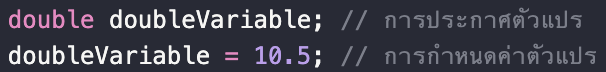
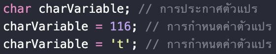
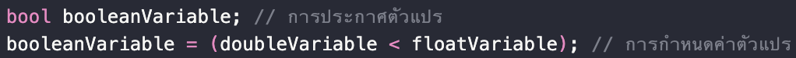
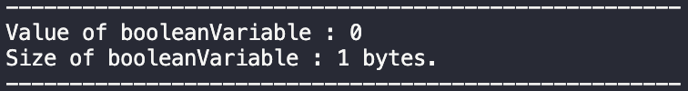
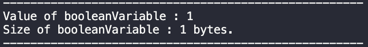

# Lab1: Basic C++ Programming
## Objectives
- เข้าใจประเภทของตัวแปรที่ใช้จัดเก็บข้อมูลและสามารถนำมาใช้ต่อยอดได้
- สามารถประยุกต์ใช้โปรแกรมที่มีเงื่อนไขในรูปแบบต่างๆได้
- สามารถประยุกต์ใช้โปรแกรมที่มีการวนซ้ำในรูปแบบต่างๆได้
## Pre-Lab
### Variable Types
การเก็บข้อมูลในตัวแปรต่างๆของการเขียนโปรแกรมจะถูกจัดเก็บอยู่ในระบบ binary data ที่จะแปลงสิ่งที่เราใส่เข้าไปให้กลายเป็นข้อมูลในระบบเลขฐาน 2 เช่น 5 จะกลายเป็น 101 เป็นต้น  
ซึ่งการประกาศตัวแปรสำหรับใช้งานใน C++ สามารถทำได้ด้วยการ

 
วิธีการประกาศตัวแปรใน C++

1. Int Variable  
   Int Variable เป็นตัวแปรพื้นฐานของ C++ ที่ใช้บรรจุข้อมูลที่เป็นจำนวนเต็มที่สามารถระบุค่าความเป็นบวกหรือลบของข้อมูลได้ด้วย bit ตัวแรกของ variables 
   
 
   วิธีการประกาศตัวแปรและค่า Int Variable

   
 
   ตัวอย่างข้อมูล Int Variable ก่อนกำหนดค่า

   
 
   ตัวอย่างข้อมูล Int Variable หลังกำหนดค่า
 

2. Float Variable  
   Float Variable เป็นตัวแปรพื้นฐานของ C++ ที่ใช้บรรจุข้อมูลที่เป็นจำนวนจริงที่สามารถระบุค่าความเป็นบวกหรือลบของข้อมูลได้ด้วย bit ตัวแรกของ variables 
   
 
   วิธีการประกาศตัวแปรและค่า Float Variable

   
 
   ตัวอย่างข้อมูล Float Variable ก่อนกำหนดค่า

   
 
   ตัวอย่างข้อมูล Float Variable หลังกำหนดค่า
 

3. Double Variable  
   Double Variable เป็นตัวแปรพื้นฐานของ C++ ที่ใช้บรรจุข้อมูลได้แบบเดียวกับ Float Variable แต่สามารถจัดเก็บได้มากกว่า Float 2 เท่า 
   
 
   วิธีการประกาศตัวแปรและค่า Double Variable

   
 
   ตัวอย่างข้อมูล Double Variable ก่อนกำหนดค่า

   
 
   ตัวอย่างข้อมูล Double Variable หลังกำหนดค่า
 

4. Character Variable  
   Character Variable เป็นตัวแปรพื้นฐานของ C++ ที่ใช้บรรจุข้อมูลตัวอักษร โดยข้อมูลที่เราประกาศค่าให้กับตัวแปรจะสามารถอยู่ในรูปแบบของ ตัวอักษร หรือ รหัส ASCII ก็ได้ 
   
 
   วิธีการประกาศตัวแปรและค่า Character Variable

   
 
   ตัวอย่างข้อมูล Character Variable ก่อนกำหนดค่า

   
 
   ตัวอย่างข้อมูล Character Variable หลังกำหนดค่า
 

5. Boolean Variable  
   Character Variable เป็นตัวแปรพื้นฐานของ C++ ที่ใช้บรรจุข้อมูลตัวอักษร โดยข้อมูลที่เราประกาศค่าให้กับตัวแปรจะสามารถอยู่ในรูปแบบของ ตัวอักษร หรือ รหัส ASCII ก็ได้ 
   
 
   วิธีการประกาศตัวแปรและค่า Boolean Variable

   
 
   ตัวอย่างข้อมูล Boolean Variable ก่อนกำหนดค่า

   
 
   ตัวอย่างข้อมูล Boolean Variable หลังกำหนดค่า
 

6. Array  
   Array จะเป็น variable ที่ใช้เก็บข้อมูลเป็นกลุ่มอย่างโดยจะสร้างขึ้นจาก Variable พื้นฐาน เช่น Int Float Char เป็นต้น 
   
 
   วิธีการประกาศตัวแปรและค่า Array of characters

   
 
   ขนาดและความยาวของ Array of characters

   จากขนาดและความยาวที่แตกต่างกันในกรณีพิเศษของ Array of characters จะมีการเก็บ '\0' ไว้เป็นตัวสุดท้ายเสมอเพื่อบอกตำแหน่งการสิ้นสุดของข้อมูลที่จัดเก็บอยู่ 
   
 
   วิธีการประกาศตัวแปรและค่า Array of characters

   

 
   จากทั้ง 2 ตัวอย่างขนาดของข้อมูลของ Array จะขึ้นอยู่กับชนิดของ Variable ที่ใช่ในการสร้างและจำนวนข้อมูลที่เก็บอยู่ 
   ** ข้อกำหนดสำคัญของ Array ** 
   - Array ไม่สามารถเปลี่ยนแปลงขนาดใหม่หลังจากประกาศแล้วได้อีก  
   - Array ไม่สามารถเปลี่ยนแปลงข้อมูลทั้งหมดทีเดียวได้  

### Condition
 1. If-Else Condition  
    If-Else Condition เป็นวิธีการสร้างเงื่อนไขโดยใช้ตัวแปรที่ประกาศขึ้นมาแล้วเป็นตัวกำหนดเงื่อนไข  
    ซึ่งการสร้างเงื่อนไขโดยใช้ If-Else จะมีตัวเลือกในการสร้างเงื่อนไข 3 ตัวเลือกคือ 
    
 ตัวเลือกในการสร้างเงื่อนไข 

    หลักการทำงานในการพิจารณาเงื่อนไขของ If-Else Condition นั้นจะ <u>พิจารณาตามลำดับของเงื่อนไข</u> ที่เราสร้างขึ้น 
    ทั้งนี้ผลลัพธ์ที่จะเกิดขึ้นจากเงื่อนไขนั้นจะ <u>ขึ้นอยู่กับค่าของตัวแปร</u> ที่เรากำหนดไว้ในเงื่อนไขนั้นๆ เช่น
    
 ตัวแปรที่ใช้กำหนดเงื่อนไข 

    
 ผลลัพธ์จากโปรแกรมที่ได้สร้างเงื่อนไขและตัวแปรตามรูปข้างต้น

 2. Switch-Case Condition 
    Switch-Case Condition เป็นการสร้างเงื่อนไขโดยใช้ตัวแปรในลักษณะเดียวกันกับ If-Else Condition <u>แต่จะมีความแตกต่างในการสั่งการและการสร้างเงื่อนไข</u> 
    - Switch-Case Condition จะทำการ <u>สั่งการโดยพิจารณาแบบเฉพาะเจาะจงไปที่เงื่อนไขที่มีรูปแบบนั้นทันที</u> ต่างจาก If-Else Condition ที่สั่งการเป็นลำดับก่อนหลัง
    - Switch-Case Condition จะสร้างเงื่อนไขโดยการเจาะจงค่าของตัวแปรที่เรากำหนดไว้โดยไม่ซ้ำกัน
    
 ตัวแปรที่ใช้ในการกำหนดเงื่อนไข 

    
 วิธีการสร้างเงื่อนไขด้วย Switch-Case 

    
 ผลลัพธ์จากโปรแกรมที่ได้สร้างเงื่อนไขและตัวแปรตามรูปข้างต้น

    
### Loop
โปรแกรมในการวนซ้ำเป็นโปรแกรมที่ใช้ลักษณะการสร้างเง่ือนไขมาเป็นข้อกำหนดในการทำงานและหยุดทำงานการวนซ้ำซึ่งจะมีอยู่ 3 วิธีการหลัก
1. While-Loop  
   While-Loop เป็นการสร้างการวนซ้ำจากเงื่อนไขที่กำหนดไว้ในคำสั่ง while() เพื่อจะควบคุมการทำงาน  
   โดยจะทำการเริ่มทำงานหรือวนซ้ำเมื่อเงื่อนไขถูกต้องและหยุดการทำงานเมื่อเงื่อนไขผิด
2. Do While-Loop  
   Do While-Loop จะมีลักษณะการสร้างเงื่อนไขเพื่อควบคุมการทำงานเหมือน While-Loop  
   แต่จะแตกต่างกันที่ Do While-Loop จะเริ่มทำงานทันทีโดยไม่สนใจเงื่อนไข แล้วค่อยเริ่มตรวจเงื่อนไขในการวนซ้ำครั้งต่อไป  
3. For-Loop  
   For-Loop มีลักษณะการควบคุมการทำงานด้วยเงื่อนไขเหมือน While-loop  
   แต่จะมีความแตกต่างกันในการกำหนดขอบเขตการวนซ้ำโดยจะมีการสร้างตัวแปรเพิ่มเติมขึ้นมาที่ใช้ในการวนซ้ำของ For-Loop ภายใน for()  
    
 การสร้าง For-Loop 

    
 ผลลัพธ์จาก For-Loop ข้างต้น

## In-Lab
- สร้างโปรแกรมที่ช่วยให้พี่ปุ้นคำนวณค่าข้าวทั้งหมดใน 1 เดือน โดยพี่ปุ้นจะกินข้าวแพงขึ้น 1.2 เท่าจากวันล่าสุดที่กินข้าวหากเป็นวันคู่ และถูกลง 0.8 เท่าจากวันล่าสุดที่กินข้าวหากเป็นวันคี่่ และทุกๆวันที่ 15 พี่ปุ้นจะอดข้าวเพื่อเก็บเงินไว้กินกุ้งเผา 
กำหนดให้ 
   - 1 เดือนมี 30 วัน 
   - เริ่มต้นวันจากวันที่ 1
- สร้างโปรแกรมช่วยพี่เนคำนวณตำแหน่งปลายทางของการเดินใน 2 มิติ โดยจะรับค่าคำสั่งเป็น Array : [1, 2, 1, 3, 1, 2, 2, 1, 3, 2, 4, 1, 2, 3, 1, 4, 1, 2, 1, 3, 1, 2, 1, 1, 4] 
กำหนดให้
   - เริ่มต้นที่ตำแหน่งแกน x = 0, y = 0 
   - 1 คือคำสั่งเดินไปข้างหน้า 1 หน่วย
   - 2 คือคำสั่งเดินไปทางซ้าย 1 หน่วย
   - 3 คือคำสั่งเดินไปข้างหลัง 1 หน่วย
   - 4 คือคำสั่งเดินไปทางขวา 1 หน่วย
   - หากพี่เนกลับมาที่ตำแหน่งเริ่มต้น พี่เนจะวาร์ปไปยังตำแหน่งแกน x = 1, y = 1

## Post-Lab
ตรวจ Exercise ใน In-Lab กับพี่ๆ T.A.