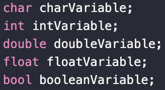
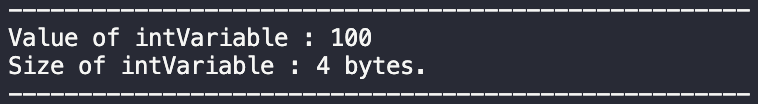
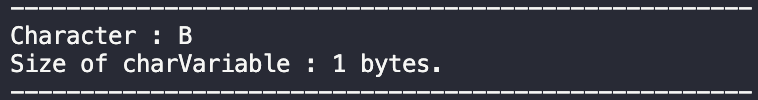
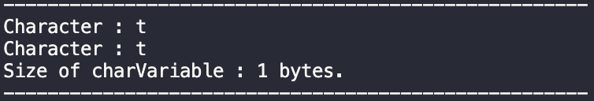

# Lab1: Basic C++ Programming
## Objectives
- เข้าใจประเภทของตัวแปรที่ใช้จัดเก็บข้อมูลและสามารถนำมาใช้ต่อยอดได้
- สามารถสร้างและดัดแปลงโปรแกรมที่มีเงื่อนไขในรูปแบบต่างๆได้
- สามารถสร้างและดัดแปลงโปรแกรมที่มีการวนซ้ำในรูปแบบต่างๆได้
## Pre-Lab
### Variable Types
การเก็บข้อมูลในตัวแปรต่างๆของการเขียนโปรแกรมจะถูกจัดเก็บอยู่ในระบบ binary data ที่จะแปลงสิ่งที่เราใส่เข้าไปให้กลายเป็นข้อมูลในระบบเลขฐาน 2 เช่น 5 จะกลายเป็น 101 เป็นต้น  
ซึ่งการประกาศตัวแปรสำหรับใช้งานใน C++ สามารถทำได้ด้วยการ

 
วิธีการประกาศตัวแปรใน C++

1. Int Variable  
   Int Variable เป็นตัวแปรพื้นฐานของ C++ ที่ใช้บรรจุข้อมูลที่เป็นจำนวนเต็มที่สามารถระบุค่าความเป็นบวกหรือลบของข้อมูลได้ด้วย bit ตัวแรกของ variables 
   
 
   วิธีการประกาศตัวแปรและค่า Int Variable

   
 
   ตัวอย่างข้อมูล Int Variable ก่อนกำหนดค่า

   
 
   ตัวอย่างข้อมูล Int Variable หลังกำหนดค่า
 

2. Float Variable  
   Float Variable เป็นตัวแปรพื้นฐานของ C++ ที่ใช้บรรจุข้อมูลที่เป็นจำนวนจริงที่สามารถระบุค่าความเป็นบวกหรือลบของข้อมูลได้ด้วย bit ตัวแรกของ variables 
   
 
   วิธีการประกาศตัวแปรและค่า Float Variable

   
 
   ตัวอย่างข้อมูล Float Variable ก่อนกำหนดค่า

   
 
   ตัวอย่างข้อมูล Float Variable หลังกำหนดค่า
 

3. Double Variable  
   Double Variable เป็นตัวแปรพื้นฐานของ C++ ที่ใช้บรรจุข้อมูลได้แบบเดียวกับ Float Variable แต่สามารถจัดเก็บได้มากกว่า Float 2 เท่า 
   
 
   วิธีการประกาศตัวแปรและค่า Double Variable

   
 
   ตัวอย่างข้อมูล Double Variable ก่อนกำหนดค่า

   
 
   ตัวอย่างข้อมูล Double Variable หลังกำหนดค่า
 

4. Character Variable  
   Character Variable เป็นตัวแปรพื้นฐานของ C++ ที่ใช้บรรจุข้อมูลตัวอักษร โดยข้อมูลที่เราประกาศค่าให้กับตัวแปรจะสามารถอยู่ในรูปแบบของ ตัวอักษร หรือ รหัส ASCII ก็ได้ 
   
 
   วิธีการประกาศตัวแปรและค่า Character Variable

   
 
   ตัวอย่างข้อมูล Character Variable ก่อนกำหนดค่า

   
 
   ตัวอย่างข้อมูล Character Variable หลังกำหนดค่า
 

5. Boolean Variable  

6. Array  
   Array จะเป็น variable ที่ใช้เก็บข้อมูลเป็นกลุ่มอย่างโดยจะสร้างขึ้นจาก Variable พื้นฐาน เช่น Int Float Char เป็นต้น 

### Function
Function สำหรับ C++ จะมีรูปแบบการประกาศได้ 2 แบบหลักๆ คือ การประกาศแบบมีการ return ข้แมูลกลับสู่ global และไม่มีการ return 
การประกาศแบบไม่ return 

### Condition
 1. If-Else Condition  
    If-Else Condition เป็นวิธีการสร้างเงื่อนไขโดยใช้ตัวแปรที่ประกาศขึ้นมาแล้วเป็นตัวกำหนดเงื่อนไข  
    ซึ่งการสร้างเงื่อนไขโดยใช้ If-Else จะมีตัวเลือกในการสร้างเงื่อนไข 3 ตัวเลือกคือ
    
image

    หลักการทำงานในการพิจารณาเงื่อนไขของ If-Else Condition นั้นจะ <u>พิจารณาตามลำดับของเงื่อนไข</u> ที่เราสร้างขึ้น ตัวอย่างเช่น
    
image

    ทั้งนี้ผลลัพธ์ที่จะเกิดขึ้นจากเงื่อนไขนั้นจะ <u>ขึ้นอยู่กับค่าของตัวแปร</u> ที่เรากำหนดไว้ในเงื่อนไขนั้นๆ เช่น
    
image

 2. Switch-Case Condition  
    Switch-Case Condition เป็นการสร้างเงื่อนไขโดยใช้ตัวแปรในลักษณะเดียวกันกับ If-Else Condition <u>แต่จะมีความแตกต่างในการสั่งการและการสร้างเงื่อนไข</u> 
    - Switch-Case Condition จะทำการ <u>สั่งการโดยพิจารณาแบบเฉพาะเจาะจงไปที่เงื่อนไขที่มีรูปแบบนั้นทันที</u> ต่างจาก If-Else Condition ที่สั่งการเป็นลำดับก่อนหลัง
    - Switch-Case Condition จะสร้างเงื่อนไขโดยการเจาะจงค่าของตัวแปรที่เรากำหนดไว้โดยไม่ซ้ำกัน ตัวอย่างเช่น
    
image

    
### Loop
1. For-Loop  
2. While-Loop  

## In-Lab
- สร้างโปรแกรมที่ช่วยให้พี่ปุ้นคำนวณค่าข้าวทั้งหมดใน 1 เดือน โดยพี่ปุ้นจะกินข้าวแพงขึ้น 1.2 เท่าจากวันล่าสุดที่กินข้าวหากเป็นวันคู่ และถูกลง 0.8 เท่าจากวันล่าสุดที่กินข้าวหากเป็นวันคี่่ และทุกๆวันที่ 15 พี่ปุ้นจะอดข้าวเพื่อเก็บเงินไว้กินกุ้งเผา 
( กำหนดให้ 1 เดือนมี 30 วัน เริ่มต้นจากวันที่ 1 )
## Post-Lab
เช็คงานกับพี่ๆ T.A. ในคลาส LAB หรือในช่วง Office Hour
