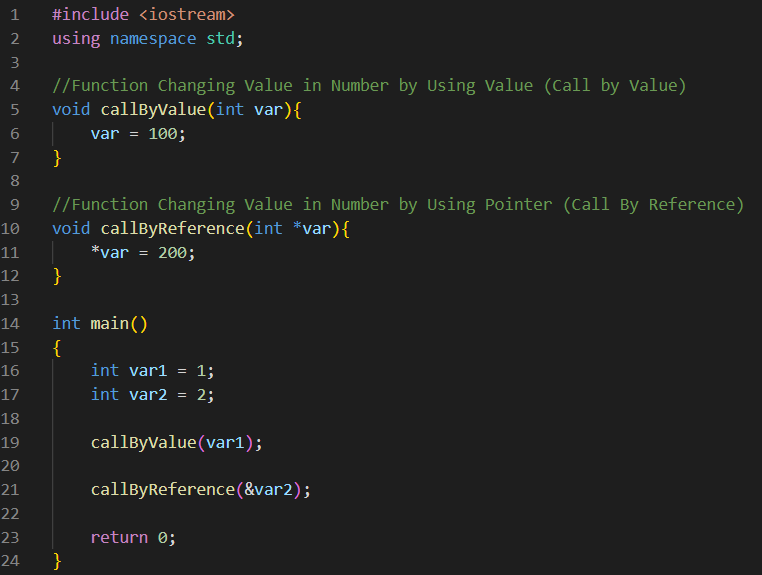

# Lab2 : Pointer Manipulation
## Objective 
1. ทำความเข้าใจความแตกต่างระหว่างค่าของ variable และ address ของ variable
2. สร้าง pointer เพื่ออ้างอิงไปยัง variable ตัวอื่น
3. สามารถเปลี่ยนค่าของ variable ตัวอื่นโดยใช้ pointer
4. ประยุกต์ใช้งาน pointer กับการเขียน function

## Pre-lab
- เรียนและทำความเข้าใจเนื้อหาในเรื่อง pointers จากอาจารย์โซ่
- วิดีโอสำหรับทบทวน Concept ของ pointers เพิ่มเติม: 
    1. แบบสั้น ๆ : [concept_of_pointers](https://www.youtube.com/watch?v=UvoHwFvAvQE&t=186s&ab_channel=saikumar)
    2. แบบละเอียดยิบ : [pointers_in_cpp](https://www.youtube.com/watch?v=zuegQmMdy8M&t=619s&ab_channel=freeCodeCamp.org)

  

- จากคุณสมบัติของ pointers ที่ได้เรียนมา จะเห็นว่าการใช้ pointer มีประโยชน์หลายอย่าง เช่น
    1. การใช้ pointer ทำให้สามารถสร้าง dynamic data structures (ขนาดของ data structure สามารถเปลี่ยนแปลงได้ระหว่างทำงาน)
    2. pointer ทำให้การเข้าถึงข้อมูลที่มีโครงสร้างขนาดใหญ่เร็ว
    3. การใช้ pointer ช่วยประหยัดพื้นที่ของ memory ที่ใช้งาน
    4. สามารถใช้ pointer ทำ object reference ใน function หรือ data object

- จากประโยชน์ของ pointer ทำให้บางครั้งจำเป็นต้องใช้ variable ประเภท pointer ในการเขียน code โดยใน Lab2 นี้จะมาเรียนรู้การใช้ pointer เบื้องต้น

## In-lab : Pointers

### Part 1: 
1. สามารถใช้ pointer ในการอ้างอิงไปยัง variable อื่น ๆ ได้ดังนี้ดังนี้ 
    - สร้าง variable และ pointer เพื่อชี้ไปยัง variable ที่ต้องการ  
      
    - เปลี่ยนค่า variable โดยใช้ pointer  
      

2. ในการสร้าง pointer หากไม่ได้ assign ตำแหน่งในการชี้ตั้งแต่แรก pointer จะสุ่มชี้ต่ำแหน่งใน memory และอาจเกิดปัญหาได้ ดังนั้นหากจะสร้างตัวแปร pointer ที่ยังไม่มีการ assign ตำแหน่งที่ชี้ จะต้องระบุค่าเป็น NULL ก่อน โดยสามารถทำได้ดังนี้  
      

3. variable ที่เป็น pointer ยังสามารถนำมาชี้ variable ประเภทอื่น ๆ ได้อีก เช่น float, double, char, bool หรืออาจจะชี้ pointer ด้วยกันเอง  
      

4. การใช้ "*" (Asterisk) และ "&" (Ampersand) เป็นแบบ definitions/declare และแบบ expression จะมีความหมายและการใช้งานที่แตกต่างกัน โดยสามารถสรุปได้ดังตารางด้านล่างนี้   

|   | definition/declare |  expression |
|:-:|:------------------:|:-----------:|
| *   (Asterisk) | ประกาศ variable ประเภท pointer   Ex: int *x = NULL; | รับหรือเปลี่ยนค่าตำแหน่ง address   ที่ pointer x ชี้ (Dereference)   Ex: *x = 3; |
| &   (Ampersand) | ประกาศ variable ประเภท reference   (ยังไม่ต้องสนใจตอนนี้)| address ของ variable   Ex: x = &y; |

 

#### Exercise 1:
    ลองสร้าง variable 1 ตัวขึ้นมาและแสดงค่าและ adress ของ variable นั้นบน terminal
    จากนั้นลองเปลี่ยนค่าของ variable ตัวนั้นและแสดงค่าและ adress ของ variable บน terminal อีกครั้ง

#### Exercise 2:
    ให้สร้างและใช้ pointer เพื่อเปลี่ยนค่าของ variable ใน Exercise 1 
    และแสดงผลค่าของตัวแปรที่เปลี่ยนและ address ของ variable นั้น

### Part 2: Call by Value and Call by Reference
- อย่างที่กล่าวมาข้างต้นหนึ่งในประโยชน์ของ pointer คือการนำมาประยุกต์ใช้ใน function โดยการใช้ pointer เพื่อนำ variable เข้า function
- ในการนำ variable เข้า function สามารถแบ่งได้ 2 รูปแบบ คือ Call by Value และ Call by Reference 
    1. Call by Value : ค่า variable ที่นำเข้า function จะ**ไม่เปลี่ยนแปลง** เนื่องจากเป็นการนำค่าของ variable เก็บไว้ใน local variable เมื่อแก้ค่า local variable แล้วจะไม่เกิดการส่งผลต่อ variable ที่นำเข้าไป
    2. Call by Reference : ค่า variable ที่นำเข้า function จะ**เปลี่ยนแปลง** เนื่องจากเป็นการนำ address ของ variable เข้าไปใน function (ประยุกต์ใช้ pointer) ดังนั้น local variable จะใช้ตำแหน่งใน memory เป็นตำแหน่งเดียวกันเมื่อแก้ค่าที่ตำแหน่งนั้นแล้วค่าของ variable ที่นำเข้าก็จะเปลี่ยนแปลงไปตามไปด้วย  
- จากรูปแบบการนำ variable เข้า function ที่กล่าวมาสามารถเขียน code ได้ดังนี้  
      

#### Exercise 3:
    ลองเขียน function callByValue และ callByReference ตามตัวอย่างด้านบน และลองใช้งาน และแสดงผลค่าของตัวแปรเมื่อเข้า function ผ่าน terminal 

#### Exercise 4: Call by Value
    เขียน function (function ประเภท tuple) สำหรับการสลับค่าระหว่าง 2 variables (variable ประเภท int) และ return ค่าใหม่ออกมา

`Hint`
- `ต้องทำการ #include<tuple>`
- `ตัวอย่างการสร้างและใช้งาน function ประเภท tuple เพื่อ return หลายค่า ->` [function_using_tuple](https://www.geeksforgeeks.org/returning-multiple-values-from-a-function-using-tuple-and-pair-in-c/)

#### Exercise 5: Call by Reference
    เขียน function (function ประเภท void) สำหรับการสลับค่าระหว่าง 2 variables (variable ประเภท int) โดยใช้คุณสมบัติของ pointer

## Post-lab
- ตรวจ Exercise ใน In-lab กับพี่ TA