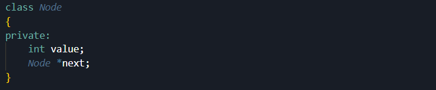
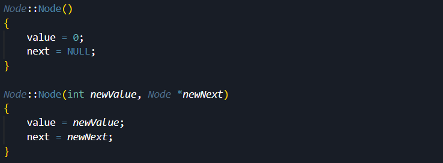
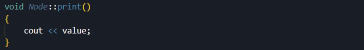
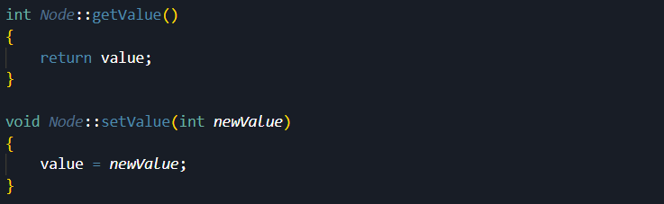
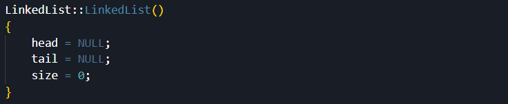
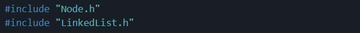

# Lab 3: Data Structure (1) - Node and Linked List

## Objective

ในแลปนี้จะให้ลองสร้าง Data Structure เบื้องต้น นั่นคือ Node และ Linked List โดยสิ่งที่จะต้องทำให้ได้คือ 

1. สร้าง Node class ที่จะแสดงถึง item ชิ้นหนึ่งภายในลิสต์

2. สร้าง Linked List class

3. สร้าง Linked List function เช่น insert และ delete

4. ทดสอบและประยุกต์ใช้งาน Linked List

## Prelab: Data Structure

ใน Lab นี้ เราจะเรียนรู้ concept ของ encapsulation ใน OOP ผ่านหัวข้อที่เรียกว่า Data Structure 

*** ให้ทบทวนเนื้อหาที่อ.โซ่สอนก่อนเข้าคลาสด้วย พร้อมทำความเข้าใจเนื้อหาต่อไปนี้ ***

Data Structure คือโครงสร้างของข้อมูลในรูปแบบต่างๆที่เราสามารถใช้ เพื่อจัดเก็บ จัดระเบียบ และเรียกใช้งานข้อมูลได้อย่างมีประสิทธิภาพ

ใน Lab นี้ เราจะสร้าง Data Structure พื้นฐานที่ชื่อว่า Linked List โดยก่อนที่เราจะไปสร้าง Linked List เราจะต้องรู้จัก Node ก่อน

### Node

Node เป็นหน่วยย่อยที่สุดของ Data Structure เป็นที่ ๆ ใช้เก็บข้อมูลต่าง ๆ เอาไว้ Node จะมี data อยู่ 2 ส่วนหลัก ๆ คือ ส่วนของ value ไว้เก็บค่าต่าง ๆ และส่วนของ next ซึ่งจะบอกว่า Node ต่อจากนี้คือ Node อะไร

### Linked List

Linked List คือการนำ Node มาต่อ ๆ กันเป็นสาย เพื่อสร้างความสัมพันธ์และลำดับขั้นของข้อมูล 

    

โดย Linked List จะมี function สำคัญเช่น insert, remove ในการใส่ Node เข้ามา และลบ Node ออกไป สามารถลองเล่นและทำความเข้าใจ function ต่างๆได้ที่ https://visualgo.net/en/list

### Resource ให้อ่านเพิ่มเติม ถ้าอยากเข้าใจเพิ่มขึ้น 

1. http://www.elfhs.ssru.ac.th/wipada_ch/pluginfile.php/893/course/summary/Chapter%204-LinkedList.pdf

2. https://medium.com/@topspinppy/data-structure-%E0%B8%84%E0%B8%B2%E0%B8%9A%E0%B8%97%E0%B8%B5%E0%B9%88-1-linked-list-episode1-a29af02ebc3c

3. ลอง search คำว่า linked list, insertion, deletion แล้วทำความเข้าใจดูครับ

## Inlab

### Part 1: Node Class

ในส่วนนี้จะให้สร้าง Node Class โดย Node เป็น Object ที่ถูกใช้งานใน Linked List

- สร้างไฟล์ header ชื่อว่า Node.h สำหรับสร้าง Node Class ซึ่งจะมีตัวแปร 2 ตัว คือ 
    1. value เป็นค่าของ Node นี้ที่ต้องการนำไปใช้
    2. next เป็น Node ตัวถัดไป

    

- สร้างไฟล์ C++ ชื่อว่า Node.cpp ที่ประกอบด้วย

    1. Contructor 

    

        
    

    2. ฟังก์ชัน print

    

        
    

โดยในมาตรฐานสากล เราจะทำการเรียกใช้และแก้ไขค่าตัวแปรตาง ๆ ผ่านฟังก์ชัน getter และ setter เช่น

    

#### Exercise 1:

สร้างฟังก์ชัน getter และ setter สำหรับตัวแปร next 

### Part 2: Linked List Class

ในส่วนนี้จะให้สร้าง Linked List class และฟังก์ชันที่เกี่ยวข้องทั้งหมด

- สร้างไฟล์ header ชื่อ LinkedList.h สำหรับสร้าง Linked List Class ซึ่งจะมีตัวแปร 3 ตัว คือ
    1. head เป็น node แรก ของ Linked List
    2. tail เป็น node สุดท้าย ของ Linked List
    3. size เป็นขนาดของ Linked List

    

- สร้างไฟล์ C++ ชื่อว่า LinkedList.cpp ที่ประกอบด้วย

    1. Contructor

    

        
    

    2. ฟังก์ชัน insert ซึ่งจะรับค่าตัวแปร 2 ตัว คือ
    
        2.1 node เป็นค่าของ node ที่ต้องการเพิ่มเข้าใน List 

        2.2 pos เป็นตำแหน่งที่ต้องการจะเพิ่มเข้าไปใน List 
    
        โดยฟังก์ชันนี้จะไม่คืนค่าใด ๆ

    

        
    

    3. ฟังก์ชัน remove ซึ่งจะรับค่าตัวแปร 1 ตัว คือ pos หรือตำแหน่งที่ต้องการลบค่าใน List ออก โดยฟังก์ชันนี้จะคืนค่า node ที่ถูกลบออก

    

        
    

    4. ฟังก์ชัน print

### Part 3

ให้สร้างไฟล์ใหม่ ชื่อ main.cpp ที่ประกอบด้วยฟังก์ชัน main() ซึ่งจะมีการเรียกใช้ Node.h และ LinkedList.h ดังนี้

    

หลังจากนั้น ให้สร้าง List ขึ้นมาแล้วลองทดสอบโดยการเพิ่ม Node และลองใช้ฟังก์ชันทั้งหมด ว่าสามารถทำงานอย่างถูกต้องหรือไม่

**ในฟังก์ชันที่สร้างจะไม่เกิด Error ขึ้นเมื่อผู้ใช้ใช้งานผิดพลาด เช่น ลบ Node ที่ไม่มีอยู่ใน Linked List, และเมื่อมีการเพิ่ม Node เข้าไปในตำแหน่งแรกสุดหรือท้ายสุด**

#### Exercise 2

1. ทำฟังก์ชั่น Linked List ให้สามารถใช้งานได้ถูกต้องครบถ้วน โดยพี่ ๆ จะเข้าไปตรวจการทำงานแต่ละฟังก์ชั่น

2. เปลี่ยนจาก Singly Linked List (Node ชี้ไปที่ Node ต่อไปได้ทิศเดียว) ให้กลายเป็น Doubly Linked List (Node สามารถชี้ไปที่ Node ถัดไป และ Node ก่อนหน้าได้) 

## Postlab
ให้เตรียมอธิบายและประยุกต์ใช้สิ่งที่ทำ

